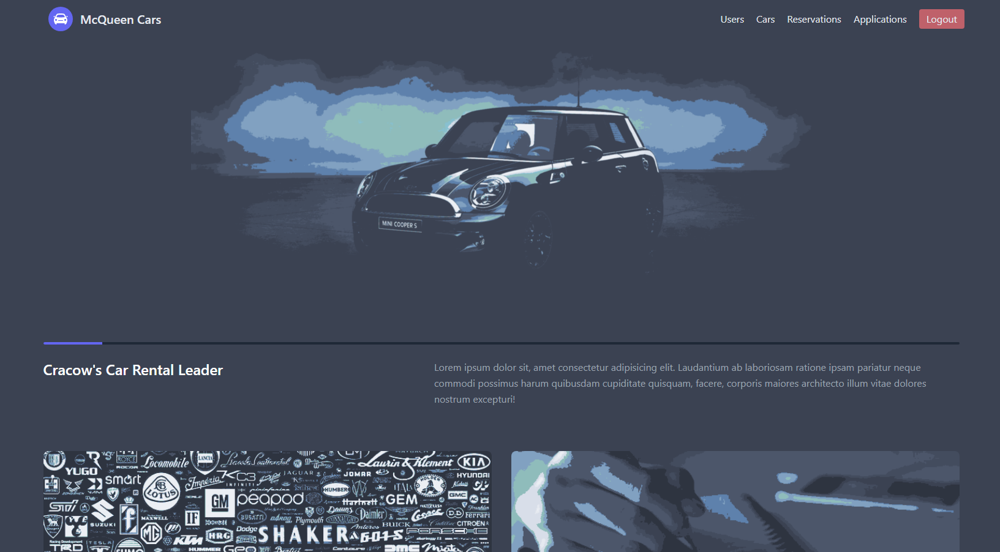
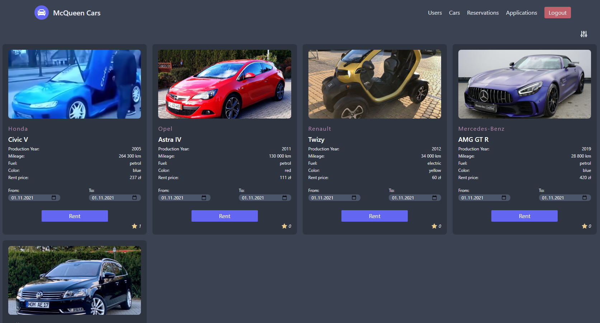
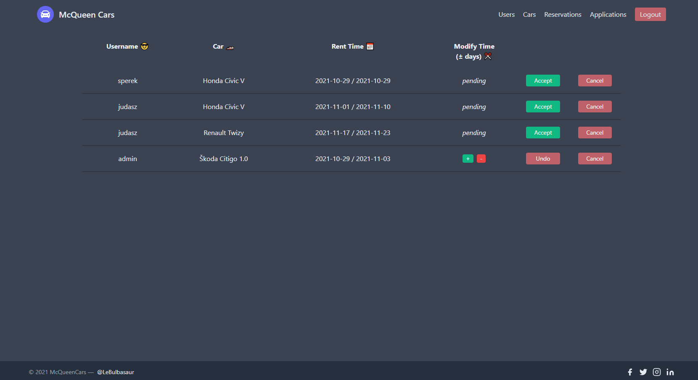
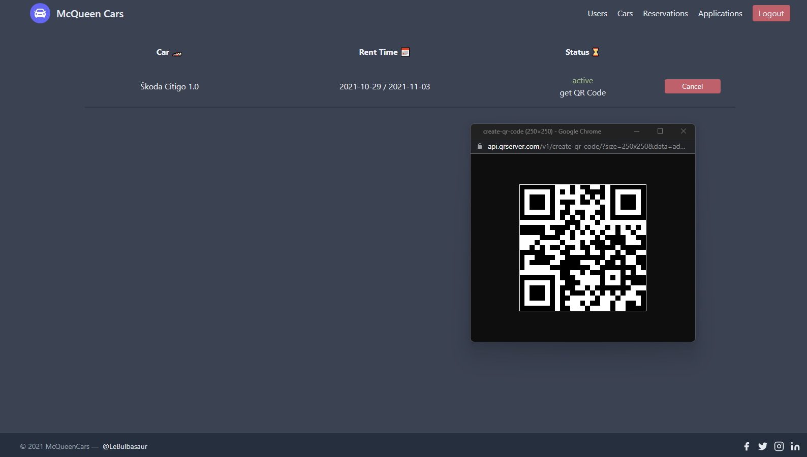

# e-commerce car renting app
This is my school project written in **Svelte** with some **PHP** to handle **MySQL** database. The application is designed to allow the customer to rent a vehicle for a given date. Submitted entries are queued and moderators can approve or reject them. Moderators are selected by the admin who oversees the entire portal. To style website I used **TailwindCSS** with [nord theme](https://www.nordtheme.com/) and [sweetalert2](https://sweetalert2.github.io/) for some nice alerts. The database is rather simple, I will try to export and place it in my *backend* directory. Admins password is *'admin'*. For other users its *'lama1234'*. Passwords are encrypted, and DB is secured against SQL injection. Temporary data is stored in PHP session. 

# Installing packages
Use npm installation command
```
npm install
```

# Running app
To to run game use
```
npm run dev
```
You will also need [xampp](https://www.apachefriends.org/pl/index.html) to run local MySQL server witch Apache to handle PHP files

# Some screenshots to showcase website:




